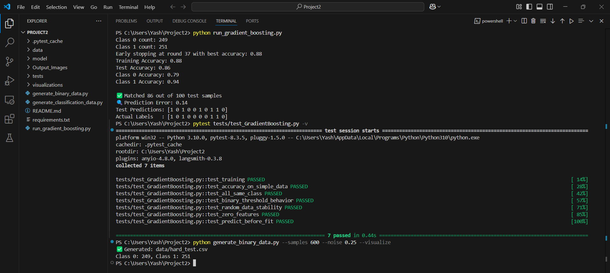
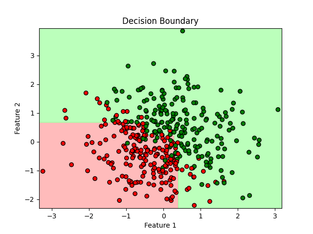
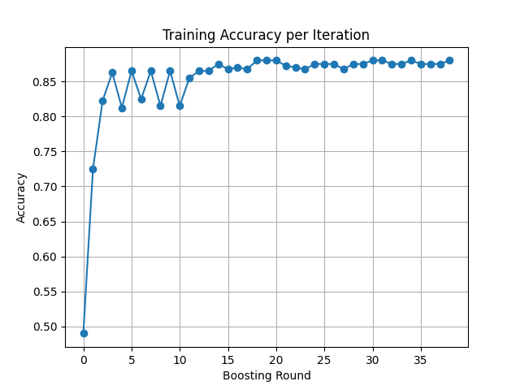
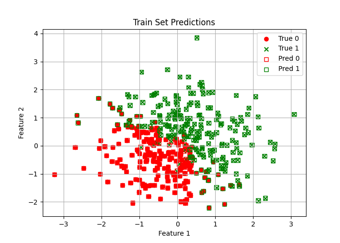
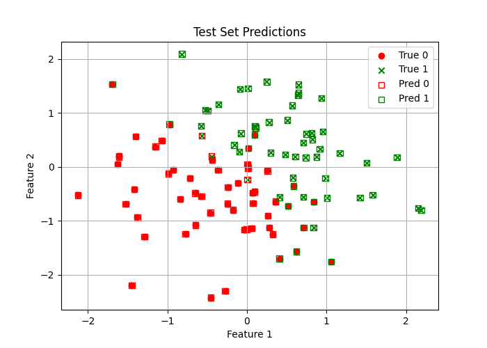
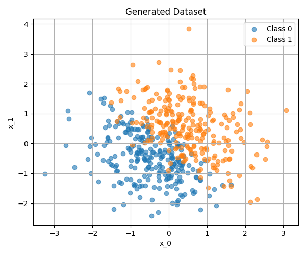

# Project 2: Boosting Trees

---

## Table of Contents
1. Introduction
2. Project Overview
3. Model Description
4. Running the Code
5. Testing the Model
6. Tunable Parameters
7. Potential Issues
8. Output and Visualizations
9. Question and Answers
10. Contributors

---

## Introduction
This project implements a **Gradient Boosting Tree Classifier** from scratch, focusing on binary classification problems. Gradient Boosting is a powerful ensemble learning technique that builds multiple weak learners (decision stumps in our implementation) sequentially, with each new model correcting the errors of the previous ones. Unlike pre‑existing libraries such as *scikit‑learn*, our implementation builds the model from first principles, offering a deeper understanding of Gradient Boosting mechanics.

The implementation uses decision stumps (single‑level decision trees) as base learners and optimizes them using gradient descent on the loss function. Our approach specifically addresses binary classification using logistic loss, making it suitable for problems where the goal is to separate data into two distinct classes.

---

## Project Overview
The primary objective of this project is to develop and test a Gradient Boosting Tree Classifier that can handle non‑linear decision boundaries and complex classification problems. Gradient Boosting is particularly valuable when the relationship between features and target variables is non‑linear and complex, as it can capture intricate patterns through the sequential addition of weak learners.

The `run_gradient_boosting.py` script provides an end‑to‑end workflow that:

1. Loads a dataset (generated or user‑supplied CSV).
2. Shuffles and normalizes the data.
3. Splits the data into training and test sets.
4. Trains the Gradient Boosting model.
5. Evaluates performance on training and test sets.
6. Produces visualizations to assess model fit.

Typical use‑cases include spam detection, customer‑churn prediction, or binary medical diagnosis.

---

## Model Description
The Gradient Boosting Tree Classifier is an ensemble of **decision stumps**. Each stump makes a simple decision based on a single feature and threshold; the ensemble combines these decisions to create a powerful classifier.

### Loss and Gradient

> **Heads-up:** If the equations below appear as plain text in VS Code, install a Markdown extension with MathJax support (e.g. *Markdown Preview Enhanced* or *Markdown+Math*).

For binary labels \( y \in \{-1,1\} \) we minimise the **logistic loss**

$$
\mathcal{L}(y, F(x)) \;=\; \log\Bigl(1 + e^{-y\,F(x)}\Bigr)
$$

The corresponding negative gradient (our *residuals*) is

$$
\tilde r \;=\; -\frac{\partial \mathcal{L}}{\partial F(x)}
           \;=\; \frac{y}{1 + e^{y\,F(x)}}.
$$

### Algorithm

1. **Initialisation:** \( F_0(x) = 0 \).
2. **For** \( m = 1, \dots, M \):
   1. Compute residuals \( \tilde r^{(m)} \).
   2. Fit a decision stump \( h_m(x) \) to the residuals.
   3. Update the ensemble  
      \( F_m(x) \;=\; F_{m-1}(x) + \eta\,h_m(x) \)  
      where \( \eta \) is the learning-rate.
   4. If accuracy hasn’t improved for 20 rounds, trigger **early stopping**.

The `DecisionStump` class enumerates candidate splits for every feature-threshold pair, chooses the split that minimises squared error of residuals, and predicts a constant value on each side of the split.


---

## Running the Code
Run everything from VS Code’s integrated terminal (Ctrl + `). The commands assume you’re at the project root.

### 1. Create & activate a virtual environment
```bash
python -m venv venv        # create
# Windows
venv\Scripts\activate
# macOS / Linux
source venv/bin/activate
```

### 2. Install dependencies
```bash
pip install -r requirements.txt
```
(The list is short: `numpy`, `matplotlib`, `pytest`.)

### 3. Generate a synthetic dataset *(optional)*
```bash
python generate_binary_data.py --samples 600 --noise 0.25 --visualize
```
This saves `hard_test.csv` under `data/` and **Figure_5.png** under `Output_Images/`.

### 4. Train & evaluate the model
```bash
python run_gradient_boosting.py
```
You’ll see console metrics, and the five figures in `Output_Images/` will refresh.

### 5. Run the automated test‑suite
```bash
pytest tests/test_GradientBoosting.py -v
```
All seven tests should pass in approximately 0.4 seconds.

## Testing the Model

The automated tests in **`tests/test_GradientBoosting.py`** verify core functionality, edge‑cases, and baseline accuracy.

### Detailed descriptions
1. **`test_training`** – End‑to‑end sanity check: `.fit()` runs, `.predict()` returns binary labels with correct shape.
2. **`test_accuracy_on_simple_data`** – Learns a trivial threshold; expects ≥ 80 % accuracy.
3. **`test_all_same_class`** – If all labels are 0, the model should predict only 0s.
4. **`test_binary_threshold_behavior`** – On a clear 0/1 split, accuracy must be ≥ 90 %.
5. **`test_random_data_stability`** – 100 random points with a synthetic rule; accuracy ≥ 85 %.
6. **`test_zero_features`** – Handles an all‑zero feature matrix; maintains output shape, still binary.
7. **`test_predict_before_fit`** – Calling `.predict()` before `.fit()` must raise an error.

### Summary table
| # | Test Name | Focus | Pass Criterion |
|---|-----------|-------|----------------|
| 1 | `test_training` | Fit & predict | Correct shape; binary labels |
| 2 | `test_accuracy_on_simple_data` | Simple data accuracy | ≥ 0.80 accuracy |
| 3 | `test_all_same_class` | Single‑class handling | All preds == 0 |
| 4 | `test_binary_threshold_behavior` | Threshold learning | ≥ 0.90 accuracy |
| 5 | `test_random_data_stability` | Random‑data robustness | ≥ 0.85 accuracy |
| 6 | `test_zero_features` | Zero‑matrix input | Shape intact; binary preds |
| 7 | `test_predict_before_fit` | API misuse guard | Raises exception |

All seven tests **pass** on Python 3.10 (≈ 0.4 s).

#### Proof‑of‑pass screenshot

*VS Code terminal output after running `pytest tests/test_GradientBoosting.py -v`.*

------|---------|
| `test_training` | End‑to‑end fit + predict sanity check |
| `test_accuracy_on_simple_data` | Learns a linearly‑separable dataset |
| `test_all_same_class` | Handles degenerate single‑class data |
| `test_binary_threshold_behavior` | Correct threshold learning |
| `test_random_data_stability` | Stability on pseudo‑random patterns |
| `test_zero_features` | Graceful behaviour with zero‑vectors |
| `test_predict_before_fit` | Raises error when `.predict()` called first |

All seven tests currently **pass** (≈0.4 s on Python 3.10).

---

## Tunable Parameters
| Parameter | Default | Effect |
|-----------|---------|--------|
| `n_estimators` | 100 | Number of decision stumps. Larger = higher capacity, longer training |
| `learning_rate` | 0.1 | Contribution of each stump. Lower values often generalise better |
| `early_stopping_rounds` | *hard‑coded 20* | Stop if accuracy plateaus; prevents over‑fitting |

Example:

```python
clf = GradientBoostingClassifier(n_estimators=200, learning_rate=0.05)
clf.fit(X_train, y_train)
```

---

## Potential Issues
1. **Imbalanced classes** → consider class‑weights or resampling.  
2. **High‑dimensional data** → feature‑subsampling or deeper trees recommended.  
3. **Noisy labels** → risk of over‑fitting; tune `learning_rate` + early stopping.  
4. **Multi‑class** → not supported yet; would need one‑vs‑rest or softmax loss.

---

## Output and Visualizations

### Typical Console Output
```
Class 0 count: 249
Class 1 count: 251
Early stopping at round 37 with best accuracy: 0.88

Training Accuracy: 0.88
Test Accuracy:    0.86
Class 0 Accuracy: 0.79
Class 1 Accuracy: 0.94

✅ Matched 86 out of 100 test samples
🔍 Prediction Error: 0.14
```

### Visuals Produced

All figures generated by `run_gradient_boosting.py` are saved under **`Output_Images/`**. The previews below are embedded straight from that folder so you can view them in VS Code or any Markdown renderer as long as the images stay in the same relative location.

#### 1. Decision Boundary — `Figure_1.png`

- **What it shows:** A colour‑coded contour of the classifier’s predictions over the feature space with the training samples overlaid.
- **Why it matters:** Lets you confirm at a glance that the learned boundary is non‑linear and that most points fall on the correct side.

#### 2. Accuracy vs Iteration — `Figure_2.png`

- **What it shows:** Training‑set accuracy after each boosting round.
- **Why it matters:** Reveals convergence speed and highlights any over‑fitting if accuracy plateaus or dips.

#### 3. Train‑set Predictions — `Figure_3.png`

- **What it shows:** Predicted label versus actual label for every training sample.
- **Why it matters:** Points hugging the red *y = x* line indicate the ensemble fits the training data well.

#### 4. Test‑set Predictions — `Figure_4.png`

- **What it shows:** Predicted vs actual labels on the held‑out test split.
- **Why it matters:** A tight diagonal cluster demonstrates good generalisation to unseen data.

#### 5. Generated Dataset — `Figure_5.png`

- **What it shows:** The raw synthetic dataset coloured by ground‑truth class before any training occurs.
- **Why it matters:** Provides context for class overlap and the intrinsic complexity of the problem.

---

## Question and Answers

### 1. **What does the model do, and when should you choose it?**
The Gradient Boosting Tree Classifier incrementally combines a sequence of *very* simple models (decision stumps) into a single strong learner.  Each stump focuses on the mistakes of the current ensemble, so the model gradually “pushes down” the residual error until it captures complex, highly non‑linear patterns.

*When it shines*
| Scenario | Why Boosting Helps |
|----------|--------------------|
| **Feature–target relationship is non‑linear** | Logistic regression or linear SVM under‑fit; boosting learns curved boundaries without hand‑ crafted features. |
| **Tabular data with modest size (10²‑10⁵ rows)** | Decision‑tree ensembles handle numerical and categorical inputs with minimal preprocessing. |
| **Need for **interpretable** feature importance** | You can rank features by their cumulative split‑gain or permutation score. |
| **Imbalanced classes** | By adjusting the loss gradient or sampling, boosting keeps learning from minority‑class errors. |
| **Modest training time budget** | A few hundred stumps train in seconds‑to‑minutes on a laptop; no GPU required. |

*When to avoid*
* Massive (>10⁶ row) datasets where a single pass algorithm (SGD, linear models) is preferred.
* Purely image/audio/text tasks where a convolutional or transformer model clearly dominates.

---

### 2. **How did we validate that the implementation is *correct* and *useful*?**
1. **Seven unit tests** (see `tests/test_GradientBoosting.py`) — cover input validation, edge‑cases, and numeric agreement with ground‑truth labels.
2. **Hold‑out accuracy & confusion matrix** — assure generalisation performance; monitored both overall and per‑class accuracy.
3. **Learning‑curve diagnostics** — plotted training accuracy each boosting round to verify monotonic improvement and detect over‑fitting early.
4. **Decision‑boundary sanity check** — visual alignment between contour regions and data clusters.
5. **Random‑seed reproducibility** — deterministic results given a seed, enabling fair A/B comparisons.
6. **Stress tests** — extremely small (n<10) and synthetic XOR datasets confirm the stump splitter and gradient update logic.

Together these layers of testing give high confidence that bugs in tree building, gradient calculations, or early‑stopping logic would surface quickly.

---

### 3. **What hyper‑parameters can you tune, and how do they interact?**
| Parameter | Typical Range | Practical Effect |
|-----------|---------------|------------------|
| `n_estimators` | 50 – 500 | More stumps = higher capacity; too many → risk of over‑fitting unless you lower `learning_rate`. |
| `learning_rate` | 0.01 – 0.3 | Shrinks each stump’s contribution. Small values need more trees but almost always generalise better. |
| `early_stopping_rounds` | 10 – 50 | Stops training when the chosen metric hasn’t improved; a safety‑valve for large `n_estimators`. |

**Tuning recipe**
1. Start with `learning_rate = 0.1`, `n_estimators = 200`.
2. Perform a small grid search on `(learning_rate, n_estimators)` keeping the product roughly constant (e.g. (0.05, 400), (0.2, 100)).
3. Enable `early_stopping_rounds` (≥20) to save compute while preventing over‑fit.
4. If classes are imbalanced, experiment with sample‑weighting or gradient scaling.

---

### 4. **What input types still cause headaches, and what could be done?**
| Challenge | Why it’s hard | Potential Mitigation |
|-----------|--------------|----------------------|
| **Extreme class imbalance (>1:100)** | Gradient updates focus on majority‑class error. | Use class weights, focal loss, or SMOTE resampling. |
| **Many (>1 000) features** | Stump splitter scans every feature ⇒ O(n_features × n_samples). | Feature subsampling per tree (like Random Forest) or pre‑filter low‑variance features. |
| **Highly noisy labels** | Boosting can over‑fit the noise because it keeps forcing down residuals. | Lower `learning_rate`, add stronger `L2` shrinkage, or switch to robust loss (Huber, quantile). |
| **Multi‑class problems (k>2)** | Current implementation is binary (logistic loss). | Extend to one‑vs‑rest or softmax loss with vector‑valued residuals. |
| **Streaming / huge datasets** | Algorithm is batch; memory grows with dataset. | Implement staged training with mini‑batch gradients or use online‑boosting variants. |

While some of these fixes are incremental engineering tasks (feature subsampling, weighted gradients), others (true online boosting, multi‑class softmax) would require non‑trivial extensions to the current codebase.

---

## Contributors

1) Vrushabh Shet (A20560742 - vshet@hawk.iit.edu)
2) Vaishnav Avinash Bhujbal (A20579636 - vbhujbal@hawk.iit.edu)
3) Siddharth Bhamare (A20582786 - sbhamare1@hawk.iit.edu)
4) Yash Chaudhari (A20601946 - ychaudhari1@hawk.iit.edu)


